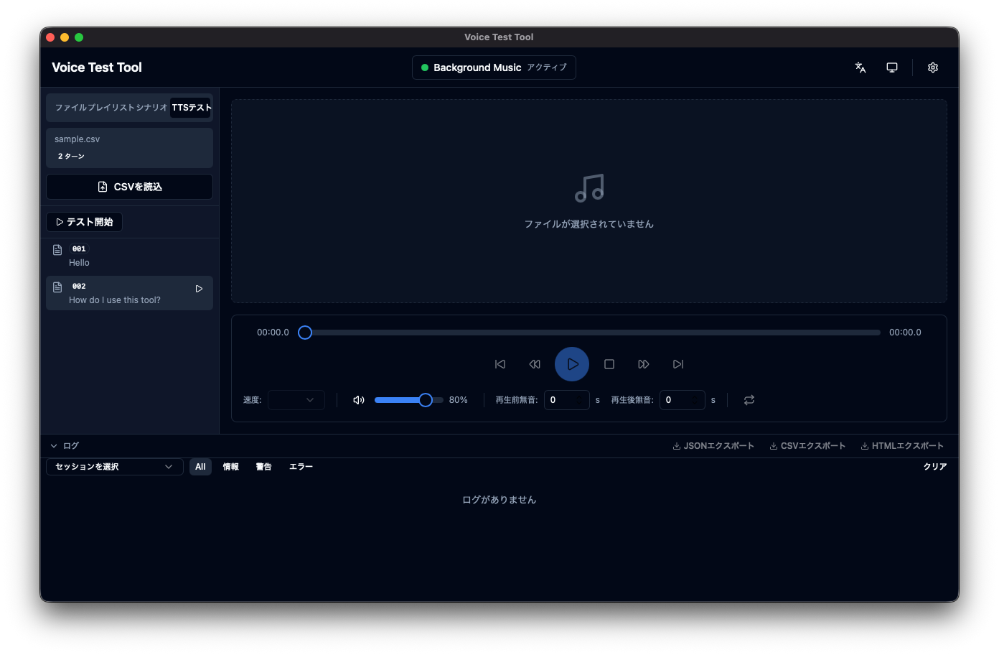

# Voice Test Tool

A desktop application for automating voice dialogue system (voice chatbot) testing.
Feeds pre-recorded audio files to target systems via virtual microphone devices, improving test reproducibility and efficiency.

**Framework:** Tauri 2.x (Rust backend + React/TypeScript frontend)



## Supported Platforms

| OS | Virtual Device |
|----|----------------|
| macOS | BlackHole / Soundflower (pre-installed driver required) |
| Windows | VB-Audio Virtual Cable / VoiceMeeter (pre-installed driver required) |
| Linux | PulseAudio null-sink (auto-created) |

## Quick Start

```bash
# Prerequisites: Rust 1.75+, Node.js 20+

cd voice-test-tool
npm install
npm run tauri dev
```

## Build

```bash
cd voice-test-tool
npm run tauri build
```

Platform-specific installers are generated in `src-tauri/target/release/bundle/`.

## CI/CD

GitHub Actions runs automated builds across 3 platforms (macOS / Windows / Linux):

- **`build.yml`** — Build check on push/PR to `main`
- **`release.yml`** — Release build on `v*` tag push, uploads to GitHub Releases

```bash
# Create a release
git tag v0.1.0
git push origin v0.1.0
```

## Project Structure

```
rs-voice-test-tools/
├── .github/workflows/     # CI/CD workflows
└── voice-test-tool/       # Tauri application
    ├── src/               # React frontend
    ├── src-tauri/         # Rust backend
    └── README.md          # Detailed documentation
```

See [`voice-test-tool/README.md`](voice-test-tool/README.md) for detailed documentation.

## License

MIT
