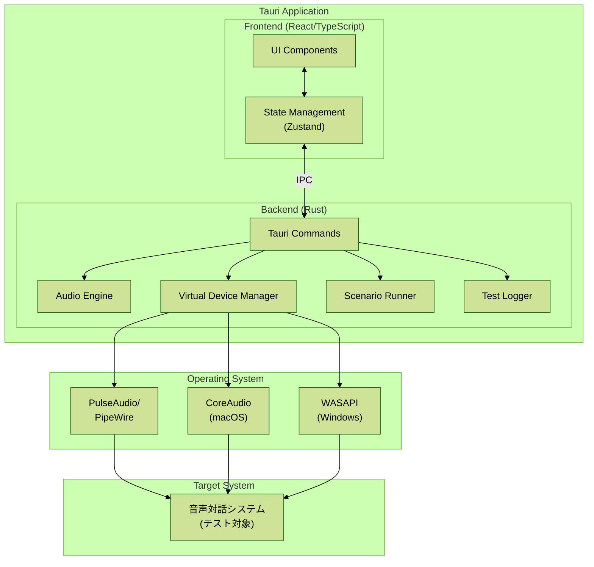
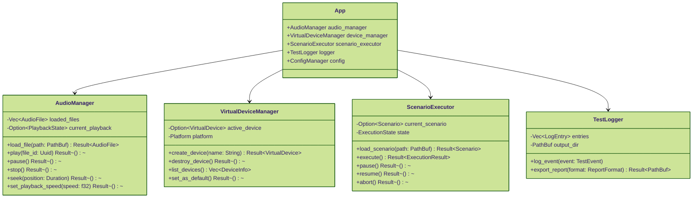
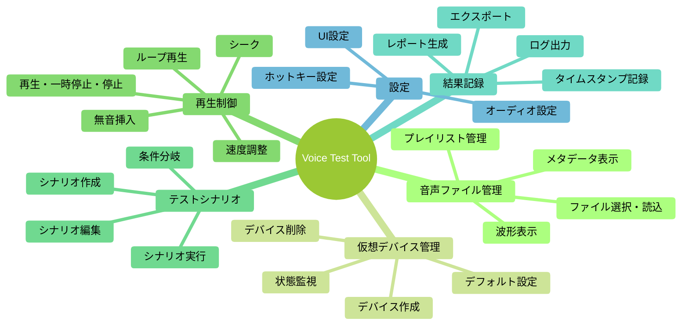
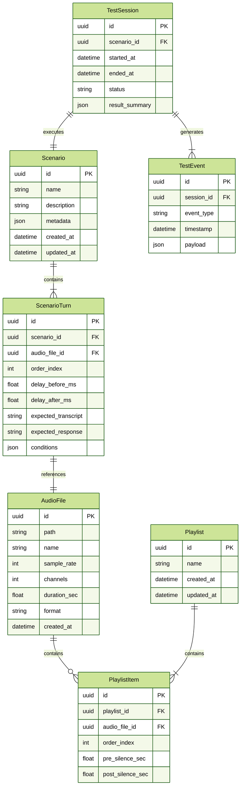
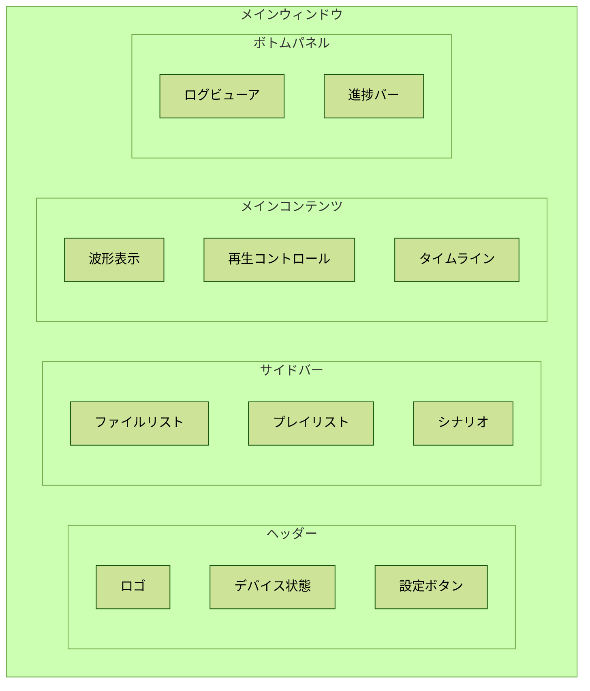
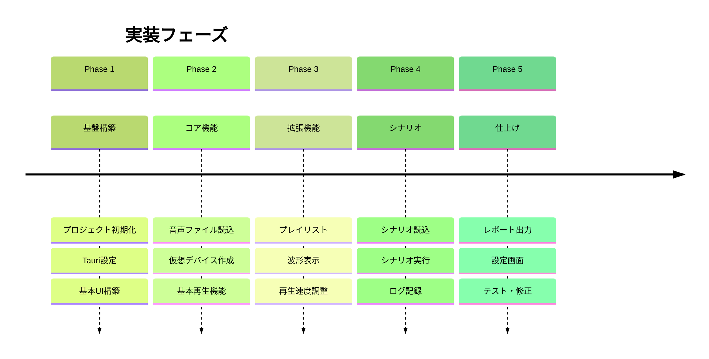

# 音声対話システムテストツール 設計書

> **Document Version:** 1.0.0  
> **Last Updated:** 2025-02-03  
> **Framework:** Tauri 2.x

---

## 目次

- [1. プロジェクト概要](#1-プロジェクト概要)
  - [1.1 目的](#11-目的)
  - [1.2 スコープ](#12-スコープ)
- [2. システムアーキテクチャ](#2-システムアーキテクチャ)
  - [2.1 全体構成図](#21-全体構成図)
  - [2.2 コンポーネント構成](#22-コンポーネント構成)
- [3. 機能要件](#3-機能要件)
  - [3.1 機能一覧](#31-機能一覧)
  - [3.2 機能詳細](#32-機能詳細)
- [4. 非機能要件](#4-非機能要件)
  - [4.1 性能要件](#41-性能要件)
  - [4.2 信頼性要件](#42-信頼性要件)
  - [4.3 ユーザビリティ要件](#43-ユーザビリティ要件)
- [5. 技術スタック](#5-技術スタック)
  - [5.1 フロントエンド](#51-フロントエンド)
  - [5.2 バックエンド (Rust)](#52-バックエンド-rust)
- [6. 使用ライブラリ一覧](#6-使用ライブラリ一覧)
  - [6.1 Rust クレート (Backend)](#61-rust-クレート-backend)
  - [6.2 npm パッケージ (Frontend)](#62-npm-パッケージ-frontend)
  - [6.3 外部ソフトウェア依存](#63-外部ソフトウェア依存)
- [7. データモデル](#7-データモデル)
  - [7.1 ドメインモデル](#71-ドメインモデル)
  - [7.2 設定データ構造](#72-設定データ構造)
- [8. API設計 (Tauri Commands)](#8-api設計-tauri-commands)
  - [8.1 コマンド一覧](#81-コマンド一覧)
  - [8.2 イベント定義](#82-イベント定義-backend--frontend)
- [9. UI設計](#9-ui設計)
  - [9.1 画面構成](#91-画面構成)
  - [9.2 画面ワイヤーフレーム](#92-画面ワイヤーフレーム)
  - [9.3 コンポーネント階層](#93-コンポーネント階層)
- [10. ディレクトリ構造](#10-ディレクトリ構造)
- [11. 実装計画](#11-実装計画)
  - [11.1 フェーズ分割](#111-フェーズ分割)
  - [11.2 詳細スケジュール](#112-詳細スケジュール)
- [12. リスクと対策](#12-リスクと対策)
- [13. 今後の拡張候補](#13-今後の拡張候補)
- [付録A: シナリオファイル形式](#付録a-シナリオファイル形式)
- [付録B: キーボードショートカット一覧](#付録b-キーボードショートカット一覧)
- [付録C: Cargo.toml サンプル](#付録c-cargotoml-サンプル)
- [付録D: package.json サンプル](#付録d-packagejson-サンプル)

---

## 1. プロジェクト概要

### 1.1 目的

音声対話システム (音声チャットボット) のテストを自動化・効率化するためのGUIアプリケーションを開発する．本ツールは，事前に用意した音声ファイルを仮想マイクデバイス経由で対象システムに入力し，テストの再現性と効率性を向上させる．

### 1.2 スコープ

| 項目 | 内容 |
|------|------|
| **対象OS** | Linux (PulseAudio/PipeWire)，macOS (BlackHole使用)，Windows (VB-Cable使用) |
| **対象ユーザー** | 音声対話システムの開発者・QAエンジニア |
| **主要機能** | 仮想マイク管理，音声ファイル再生，テストシナリオ実行，結果記録 |
| **GUIフレームワーク** | Tauri 2.x (Rust + Web技術) |

---

## 2. システムアーキテクチャ

### 2.1 全体構成図



### 2.2 コンポーネント構成



---

## 3. 機能要件

### 3.1 機能一覧



### 3.2 機能詳細

#### F1: 音声ファイル管理

| ID | 機能名 | 説明 | 優先度 |
|----|--------|------|--------|
| F1.1 | ファイル選択 | ローカルの音声ファイル (WAV, MP3, FLAC, OGG) を選択・読込 | 必須 |
| F1.2 | ドラッグ&ドロップ | ファイルをウィンドウにD&Dで追加 | 必須 |
| F1.3 | プレイリスト | 複数ファイルをリスト化し順次再生可能 | 必須 |
| F1.4 | 波形表示 | 音声ファイルの波形をビジュアル表示 | 推奨 |
| F1.5 | メタデータ表示 | サンプルレート，チャンネル数，長さ等を表示 | 必須 |
| F1.6 | フォルダ監視 | 指定フォルダの新規ファイルを自動検出 | 任意 |

#### F2: 仮想デバイス管理

| ID | 機能名 | 説明 | 優先度 |
|----|--------|------|--------|
| F2.1 | デバイス作成 | OS固有の仮想オーディオデバイスを作成 | 必須 |
| F2.2 | デバイス削除 | 作成したデバイスをクリーンアップ | 必須 |
| F2.3 | デフォルト設定 | 仮想デバイスをシステムのデフォルト入力に設定 | 必須 |
| F2.4 | 状態表示 | 現在のデバイス状態をリアルタイム表示 | 必須 |
| F2.5 | 自動復旧 | デバイスが切断された場合の自動再作成 | 推奨 |

#### F3: 再生制御

| ID | 機能名 | 説明 | 優先度 |
|----|--------|------|--------|
| F3.1 | 基本操作 | 再生，一時停止，停止 | 必須 |
| F3.2 | シーク | 任意の位置への移動 | 必須 |
| F3.3 | 速度調整 | 0.5x〜2.0x の再生速度変更 | 推奨 |
| F3.4 | ループ再生 | 単一ファイル/プレイリストのループ | 推奨 |
| F3.5 | 無音挿入 | 再生前後に指定秒数の無音を挿入 | 必須 |
| F3.6 | フェード | フェードイン/フェードアウト | 任意 |
| F3.7 | 音量調整 | 出力音量の調整 | 推奨 |

#### F4: テストシナリオ

| ID | 機能名 | 説明 | 優先度 |
|----|--------|------|--------|
| F4.1 | シナリオ作成 | GUIでテストシナリオを作成 | 必須 |
| F4.2 | シナリオ読込 | JSON/YAML形式のシナリオファイルを読込 | 必須 |
| F4.3 | シナリオ実行 | シナリオに従った自動再生 | 必須 |
| F4.4 | ターン間遅延 | 各ターン間の待機時間設定 | 必須 |
| F4.5 | 条件付き実行 | 前ターンの結果に基づく分岐 | 任意 |
| F4.6 | 並列実行 | 複数シナリオの同時実行 | 任意 |
| F4.7 | スケジュール実行 | 指定時刻での自動実行 | 任意 |

#### F5: 結果記録・レポート

| ID | 機能名 | 説明 | 優先度 |
|----|--------|------|--------|
| F5.1 | イベントログ | 再生開始/終了，エラー等のログ記録 | 必須 |
| F5.2 | タイムスタンプ | 各アクションのタイムスタンプ記録 | 必須 |
| F5.3 | レポート生成 | テスト結果のレポート出力 (HTML/JSON/CSV) | 必須 |
| F5.4 | スクリーンショット | 指定タイミングでのキャプチャ | 任意 |
| F5.5 | 音声録音 | システム応答音声の録音 | 推奨 |

---

## 4. 非機能要件

### 4.1 性能要件

| 項目 | 要件 |
|------|------|
| 起動時間 | 3秒以内 |
| 音声読込時間 | 100MBファイルを5秒以内 |
| メモリ使用量 | 500MB以下 (アイドル時) |
| CPU使用率 | 再生時10%以下 |
| 遅延 | 音声出力遅延50ms以下 |

### 4.2 信頼性要件

| 項目 | 要件 |
|------|------|
| エラー復旧 | デバイス切断時の自動再接続 |
| データ保全 | シナリオ・設定の自動保存 |
| ログ保持 | 最新100セッション分のログ保持 |

### 4.3 ユーザビリティ要件

| 項目 | 要件 |
|------|------|
| キーボードショートカット | 主要操作にホットキー割当 |
| ダークモード | ライト/ダークテーマ切替 |
| 多言語対応 | 日本語・英語 |
| アクセシビリティ | スクリーンリーダー対応 |

---

## 5. 技術スタック

### 5.1 フロントエンド

| カテゴリ | 技術 | バージョン | 理由 |
|----------|------|------------|------|
| フレームワーク | React | 18.x | コンポーネント指向，エコシステムの充実 |
| 言語 | TypeScript | 5.x | 型安全性 |
| スタイリング | Tailwind CSS | 3.x | ユーティリティファースト，高速開発 |
| 状態管理 | Zustand | 4.x | 軽量，シンプルなAPI |
| 波形表示 | wavesurfer.js | 7.x | 高機能な波形ライブラリ |
| アイコン | Lucide React | latest | 軽量，一貫性のあるアイコンセット |
| UIコンポーネント | shadcn/ui | latest | カスタマイズ性，アクセシビリティ |

### 5.2 バックエンド (Rust)

| カテゴリ | クレート | バージョン | 理由 |
|----------|----------|------------|------|
| GUIフレームワーク | tauri | 2.x | 軽量，セキュア，クロスプラットフォーム |
| オーディオ | cpal | 0.15 | クロスプラットフォーム対応 |
| オーディオ | rodio | 0.19 | 高レベルAPI |
| WAV処理 | hound | 3.5 | WAVファイル読み書き |
| 汎用デコード | symphonia | 0.5 | MP3, FLAC, OGG対応 |
| PulseAudio | libpulse-binding | 2.28 | Linux仮想デバイス |
| 非同期 | tokio | 1.x | 非同期ランタイム |
| シリアライズ | serde | 1.x | JSON/YAML処理 |
| ログ | tracing | 0.1 | 構造化ログ |
| エラー処理 | anyhow/thiserror | latest | エラーハンドリング |
| UUID | uuid | 1.x | 一意識別子生成 |

---

## 6. 使用ライブラリ一覧

### 6.1 Rust クレート (Backend)

#### コアフレームワーク

| クレート | バージョン | 用途 | リポジトリ |
|----------|------------|------|------------|
| `tauri` | 2.2 | GUIフレームワーク | https://github.com/tauri-apps/tauri |
| `tauri-build` | 2.0 | ビルドスクリプト | https://github.com/tauri-apps/tauri |
| `tauri-plugin-shell` | 2.0 | シェルコマンド実行 | https://github.com/tauri-apps/plugins-workspace |
| `tauri-plugin-dialog` | 2.0 | ファイルダイアログ | https://github.com/tauri-apps/plugins-workspace |
| `tauri-plugin-fs` | 2.0 | ファイルシステムアクセス | https://github.com/tauri-apps/plugins-workspace |

#### オーディオ処理

| クレート | バージョン | 用途 | リポジトリ |
|----------|------------|------|------------|
| `cpal` | 0.15 | クロスプラットフォームオーディオI/O | https://github.com/RustAudio/cpal |
| `rodio` | 0.19 | 高レベルオーディオ再生 | https://github.com/RustAudio/rodio |
| `hound` | 3.5 | WAVファイル読み書き | https://github.com/ruuda/hound |
| `symphonia` | 0.5 | 汎用オーディオデコーダ (MP3, FLAC, OGG等) | https://github.com/pdeljanov/Symphonia |
| `rubato` | 0.15 | リアルタイムリサンプリング | https://github.com/HEnquist/rubato |
| `dasp` | 0.11 | デジタルオーディオ信号処理 | https://github.com/RustAudio/dasp |

#### プラットフォーム固有 (Linux)

| クレート | バージョン | 用途 | リポジトリ |
|----------|------------|------|------------|
| `libpulse-binding` | 2.28 | PulseAudio Rustバインディング | https://github.com/jnqnfe/pulse-binding-rust |
| `libpulse-simple-binding` | 2.28 | PulseAudio Simple API | https://github.com/jnqnfe/pulse-binding-rust |
| `pipewire` | 0.8 | PipeWire Rustバインディング | https://gitlab.freedesktop.org/pipewire/pipewire-rs |

#### プラットフォーム固有 (macOS)

| クレート | バージョン | 用途 | リポジトリ |
|----------|------------|------|------------|
| `coreaudio-rs` | 0.11 | CoreAudio Rustバインディング | https://github.com/RustAudio/coreaudio-rs |

#### プラットフォーム固有 (Windows)

| クレート | バージョン | 用途 | リポジトリ |
|----------|------------|------|------------|
| `windows` | 0.58 | Windows API バインディング | https://github.com/microsoft/windows-rs |
| `wasapi` | 0.14 | WASAPI Rustバインディング | https://github.com/HEnquist/wasapi-rs |

#### 非同期・並行処理

| クレート | バージョン | 用途 | リポジトリ |
|----------|------------|------|------------|
| `tokio` | 1.43 | 非同期ランタイム | https://github.com/tokio-rs/tokio |
| `tokio-stream` | 0.1 | 非同期ストリーム | https://github.com/tokio-rs/tokio |
| `async-trait` | 0.1 | 非同期トレイト | https://github.com/dtolnay/async-trait |
| `parking_lot` | 0.12 | 高速な同期プリミティブ | https://github.com/Amanieu/parking_lot |
| `crossbeam-channel` | 0.5 | マルチプロデューサ・マルチコンシューマチャネル | https://github.com/crossbeam-rs/crossbeam |

#### シリアライズ・データ処理

| クレート | バージョン | 用途 | リポジトリ |
|----------|------------|------|------------|
| `serde` | 1.0 | シリアライズ/デシリアライズ | https://github.com/serde-rs/serde |
| `serde_json` | 1.0 | JSON処理 | https://github.com/serde-rs/json |
| `serde_yaml` | 0.9 | YAML処理 | https://github.com/dtolnay/serde-yaml |
| `toml` | 0.8 | TOML処理 (設定ファイル) | https://github.com/toml-rs/toml |

#### ログ・診断

| クレート | バージョン | 用途 | リポジトリ |
|----------|------------|------|------------|
| `tracing` | 0.1 | 構造化ログ | https://github.com/tokio-rs/tracing |
| `tracing-subscriber` | 0.3 | ログサブスクライバ | https://github.com/tokio-rs/tracing |
| `tracing-appender` | 0.2 | ファイルへのログ出力 | https://github.com/tokio-rs/tracing |

#### エラー処理

| クレート | バージョン | 用途 | リポジトリ |
|----------|------------|------|------------|
| `anyhow` | 1.0 | アプリケーションエラー | https://github.com/dtolnay/anyhow |
| `thiserror` | 2.0 | ライブラリエラー定義 | https://github.com/dtolnay/thiserror |

#### ユーティリティ

| クレート | バージョン | 用途 | リポジトリ |
|----------|------------|------|------------|
| `uuid` | 1.11 | UUID生成 | https://github.com/uuid-rs/uuid |
| `chrono` | 0.4 | 日時処理 | https://github.com/chronotope/chrono |
| `directories` | 5.0 | プラットフォーム固有ディレクトリ | https://github.com/dirs-dev/directories-rs |
| `notify` | 6.1 | ファイルシステム監視 | https://github.com/notify-rs/notify |
| `tempfile` | 3.14 | 一時ファイル | https://github.com/Stebalien/tempfile |

#### テスト

| クレート | バージョン | 用途 | リポジトリ |
|----------|------------|------|------------|
| `rstest` | 0.23 | パラメタライズドテスト | https://github.com/la10736/rstest |
| `mockall` | 0.13 | モック生成 | https://github.com/asomers/mockall |
| `criterion` | 0.5 | ベンチマーク | https://github.com/bheisler/criterion.rs |

---

### 6.2 npm パッケージ (Frontend)

#### コアフレームワーク

| パッケージ | バージョン | 用途 |
|------------|------------|------|
| `react` | ^18.3.1 | UIライブラリ |
| `react-dom` | ^18.3.1 | React DOMレンダリング |
| `@tauri-apps/api` | ^2.2.0 | Tauri JavaScript API |
| `@tauri-apps/plugin-shell` | ^2.0.0 | シェルプラグイン |
| `@tauri-apps/plugin-dialog` | ^2.0.0 | ダイアログプラグイン |
| `@tauri-apps/plugin-fs` | ^2.0.0 | ファイルシステムプラグイン |

#### 状態管理

| パッケージ | バージョン | 用途 |
|------------|------------|------|
| `zustand` | ^4.5.5 | 状態管理 |
| `immer` | ^10.1.1 | イミュータブル状態更新 |

#### UI コンポーネント

| パッケージ | バージョン | 用途 |
|------------|------------|------|
| `@radix-ui/react-*` | latest | shadcn/ui 基盤コンポーネント |
| `class-variance-authority` | ^0.7.1 | バリアント管理 |
| `clsx` | ^2.1.1 | クラス名結合 |
| `tailwind-merge` | ^2.5.5 | Tailwindクラスマージ |
| `lucide-react` | ^0.468.0 | アイコン |

#### 波形表示・オーディオ

| パッケージ | バージョン | 用途 |
|------------|------------|------|
| `wavesurfer.js` | ^7.8.12 | 波形表示 |

#### スタイリング

| パッケージ | バージョン | 用途 |
|------------|------------|------|
| `tailwindcss` | ^3.4.17 | CSSフレームワーク |
| `postcss` | ^8.4.49 | CSS処理 |
| `autoprefixer` | ^10.4.20 | ベンダープレフィックス |
| `tailwindcss-animate` | ^1.0.7 | アニメーション |

#### 国際化

| パッケージ | バージョン | 用途 |
|------------|------------|------|
| `i18next` | ^24.2.0 | 国際化フレームワーク |
| `react-i18next` | ^15.2.0 | React用i18next |

#### フォーム・バリデーション

| パッケージ | バージョン | 用途 |
|------------|------------|------|
| `react-hook-form` | ^7.54.1 | フォーム管理 |
| `zod` | ^3.24.1 | スキーマバリデーション |
| `@hookform/resolvers` | ^3.9.1 | zodリゾルバ |

#### ユーティリティ

| パッケージ | バージョン | 用途 |
|------------|------------|------|
| `date-fns` | ^4.1.0 | 日時処理 |
| `uuid` | ^11.0.3 | UUID生成 |

#### 開発ツール

| パッケージ | バージョン | 用途 |
|------------|------------|------|
| `typescript` | ^5.7.2 | TypeScript |
| `vite` | ^6.0.5 | ビルドツール |
| `@vitejs/plugin-react` | ^4.3.4 | React用Viteプラグイン |
| `eslint` | ^9.17.0 | リンター |
| `prettier` | ^3.4.2 | フォーマッター |
| `vitest` | ^2.1.8 | テストフレームワーク |
| `@testing-library/react` | ^16.1.0 | Reactテストユーティリティ |

---

### 6.3 外部ソフトウェア依存

#### Linux

| ソフトウェア | 用途 | インストール |
|--------------|------|--------------|
| PulseAudio | オーディオサーバー | `apt install pulseaudio` |
| PipeWire | モダンオーディオサーバー (推奨) | `apt install pipewire pipewire-pulse` |
| libpulse-dev | PulseAudio開発ライブラリ | `apt install libpulse-dev` |
| ALSA | オーディオドライバ | `apt install libasound2-dev` |

#### macOS

| ソフトウェア | 用途 | インストール |
|--------------|------|--------------|
| BlackHole | 仮想オーディオデバイス | https://github.com/ExistentialAudio/BlackHole |
| Soundflower | 仮想オーディオデバイス (代替) | https://github.com/mattingalls/Soundflower |

#### Windows

| ソフトウェア | 用途 | インストール |
|--------------|------|--------------|
| VB-Audio Virtual Cable | 仮想オーディオデバイス | https://vb-audio.com/Cable/ |
| VoiceMeeter | 仮想オーディオミキサー (代替) | https://vb-audio.com/Voicemeeter/ |

---

## 7. データモデル

### 7.1 ドメインモデル



### 7.2 設定データ構造

```rust
use serde::{Deserialize, Serialize};
use std::path::PathBuf;

/// アプリケーション設定
#[derive(Debug, Clone, Serialize, Deserialize)]
pub struct AppConfig {
    pub audio: AudioConfig,
    pub virtual_device: VirtualDeviceConfig,
    pub ui: UiConfig,
    pub logging: LoggingConfig,
    pub shortcuts: ShortcutConfig,
}

#[derive(Debug, Clone, Serialize, Deserialize)]
pub struct AudioConfig {
    /// デフォルトのサンプルレート
    pub default_sample_rate: u32,
    /// デフォルトのチャンネル数
    pub default_channels: u16,
    /// バッファサイズ (サンプル数)
    pub buffer_size: usize,
    /// デフォルトの再生速度
    pub default_playback_speed: f32,
    /// デフォルトの音量 (0.0-1.0)
    pub default_volume: f32,
}

#[derive(Debug, Clone, Serialize, Deserialize)]
pub struct VirtualDeviceConfig {
    /// 仮想デバイス名
    pub device_name: String,
    /// 起動時に自動作成するか
    pub auto_create_on_startup: bool,
    /// デフォルト入力として設定するか
    pub set_as_default: bool,
    /// 終了時にデバイスを削除するか
    pub cleanup_on_exit: bool,
}

#[derive(Debug, Clone, Serialize, Deserialize)]
pub struct UiConfig {
    /// テーマ (light/dark/system)
    pub theme: String,
    /// 言語
    pub language: String,
    /// ウィンドウサイズ
    pub window_width: u32,
    pub window_height: u32,
    /// 波形表示の色
    pub waveform_color: String,
    /// 波形の進行色
    pub waveform_progress_color: String,
}

#[derive(Debug, Clone, Serialize, Deserialize)]
pub struct LoggingConfig {
    /// ログレベル
    pub level: String,
    /// ログ出力ディレクトリ
    pub output_dir: PathBuf,
    /// 保持するセッション数
    pub max_sessions: usize,
}

#[derive(Debug, Clone, Serialize, Deserialize)]
pub struct ShortcutConfig {
    pub play_pause: String,
    pub stop: String,
    pub next: String,
    pub previous: String,
    pub seek_forward: String,
    pub seek_backward: String,
}
```

---

## 8. API設計 (Tauri Commands)

### 8.1 コマンド一覧

```rust
// src-tauri/src/commands/mod.rs

use tauri::State;
use crate::state::AppState;

// ============================================
// 音声ファイル管理
// ============================================

/// 音声ファイルを読み込む
#[tauri::command]
pub async fn load_audio_file(
    path: String,
    state: State<'_, AppState>,
) -> Result<AudioFileInfo, String>;

/// 読み込み済みファイル一覧を取得
#[tauri::command]
pub async fn list_audio_files(
    state: State<'_, AppState>,
) -> Result<Vec<AudioFileInfo>, String>;

/// ファイルを削除 (リストから除去)
#[tauri::command]
pub async fn remove_audio_file(
    file_id: String,
    state: State<'_, AppState>,
) -> Result<(), String>;

/// 波形データを取得
#[tauri::command]
pub async fn get_waveform_data(
    file_id: String,
    resolution: usize,
    state: State<'_, AppState>,
) -> Result<Vec<f32>, String>;

// ============================================
// 仮想デバイス管理
// ============================================

/// 仮想デバイスを作成
#[tauri::command]
pub async fn create_virtual_device(
    name: String,
    state: State<'_, AppState>,
) -> Result<DeviceInfo, String>;

/// 仮想デバイスを削除
#[tauri::command]
pub async fn destroy_virtual_device(
    state: State<'_, AppState>,
) -> Result<(), String>;

/// デバイス一覧を取得
#[tauri::command]
pub async fn list_audio_devices(
    state: State<'_, AppState>,
) -> Result<Vec<DeviceInfo>, String>;

/// デフォルト入力デバイスとして設定
#[tauri::command]
pub async fn set_default_input_device(
    device_id: String,
    state: State<'_, AppState>,
) -> Result<(), String>;

/// 現在のデバイス状態を取得
#[tauri::command]
pub async fn get_device_status(
    state: State<'_, AppState>,
) -> Result<DeviceStatus, String>;

// ============================================
// 再生制御
// ============================================

/// 再生開始
#[tauri::command]
pub async fn play(
    file_id: String,
    state: State<'_, AppState>,
) -> Result<(), String>;

/// 一時停止
#[tauri::command]
pub async fn pause(
    state: State<'_, AppState>,
) -> Result<(), String>;

/// 停止
#[tauri::command]
pub async fn stop(
    state: State<'_, AppState>,
) -> Result<(), String>;

/// シーク
#[tauri::command]
pub async fn seek(
    position_sec: f64,
    state: State<'_, AppState>,
) -> Result<(), String>;

/// 再生速度設定
#[tauri::command]
pub async fn set_playback_speed(
    speed: f32,
    state: State<'_, AppState>,
) -> Result<(), String>;

/// 音量設定
#[tauri::command]
pub async fn set_volume(
    volume: f32,
    state: State<'_, AppState>,
) -> Result<(), String>;

/// 現在の再生状態を取得
#[tauri::command]
pub async fn get_playback_state(
    state: State<'_, AppState>,
) -> Result<PlaybackState, String>;

// ============================================
// プレイリスト管理
// ============================================

/// プレイリストを作成
#[tauri::command]
pub async fn create_playlist(
    name: String,
    state: State<'_, AppState>,
) -> Result<PlaylistInfo, String>;

/// プレイリストにファイルを追加
#[tauri::command]
pub async fn add_to_playlist(
    playlist_id: String,
    file_id: String,
    pre_silence_sec: f32,
    post_silence_sec: f32,
    state: State<'_, AppState>,
) -> Result<(), String>;

/// プレイリストを再生
#[tauri::command]
pub async fn play_playlist(
    playlist_id: String,
    loop_mode: bool,
    state: State<'_, AppState>,
) -> Result<(), String>;

// ============================================
// テストシナリオ
// ============================================

/// シナリオを読み込む
#[tauri::command]
pub async fn load_scenario(
    path: String,
    state: State<'_, AppState>,
) -> Result<ScenarioInfo, String>;

/// シナリオを保存
#[tauri::command]
pub async fn save_scenario(
    scenario: ScenarioData,
    path: String,
    state: State<'_, AppState>,
) -> Result<(), String>;

/// シナリオを実行
#[tauri::command]
pub async fn execute_scenario(
    scenario_id: String,
    state: State<'_, AppState>,
) -> Result<String, String>; // session_id を返す

/// シナリオ実行を一時停止
#[tauri::command]
pub async fn pause_scenario(
    session_id: String,
    state: State<'_, AppState>,
) -> Result<(), String>;

/// シナリオ実行を再開
#[tauri::command]
pub async fn resume_scenario(
    session_id: String,
    state: State<'_, AppState>,
) -> Result<(), String>;

/// シナリオ実行を中止
#[tauri::command]
pub async fn abort_scenario(
    session_id: String,
    state: State<'_, AppState>,
) -> Result<(), String>;

// ============================================
// ログ・レポート
// ============================================

/// テストセッションのログを取得
#[tauri::command]
pub async fn get_session_logs(
    session_id: String,
    state: State<'_, AppState>,
) -> Result<Vec<LogEntry>, String>;

/// レポートをエクスポート
#[tauri::command]
pub async fn export_report(
    session_id: String,
    format: String, // "html" | "json" | "csv"
    output_path: String,
    state: State<'_, AppState>,
) -> Result<String, String>;

// ============================================
// 設定
// ============================================

/// 設定を取得
#[tauri::command]
pub async fn get_config(
    state: State<'_, AppState>,
) -> Result<AppConfig, String>;

/// 設定を更新
#[tauri::command]
pub async fn update_config(
    config: AppConfig,
    state: State<'_, AppState>,
) -> Result<(), String>;
```

### 8.2 イベント定義 (Backend → Frontend)

```typescript
// src/types/events.ts

export interface PlaybackProgressEvent {
  file_id: string;
  current_position_sec: number;
  total_duration_sec: number;
  is_playing: boolean;
}

export interface DeviceStatusEvent {
  device_name: string;
  is_active: boolean;
  is_default: boolean;
  error?: string;
}

export interface ScenarioProgressEvent {
  session_id: string;
  current_turn: number;
  total_turns: number;
  status: 'running' | 'paused' | 'completed' | 'failed' | 'aborted';
  current_file_name?: string;
}

export interface LogEvent {
  session_id: string;
  timestamp: string;
  level: 'info' | 'warn' | 'error';
  message: string;
  details?: Record<string, unknown>;
}
```

---

## 9. UI設計

### 9.1 画面構成



### 9.2 画面ワイヤーフレーム

```
┌─────────────────────────────────────────────────────────────────────────┐
│  🎤 Voice Test Tool              [● Virtual Mic: Active]    [⚙️ Settings] │
├─────────────────┬───────────────────────────────────────────────────────┤
│                 │                                                       │
│  📁 Files       │   ┌─────────────────────────────────────────────────┐ │
│  ├─ greeting.wav│   │ ▁▂▃▄▅▆▇█▇▆▅▄▃▂▁▂▃▄▅▆▇█▇▆▅▄▃▂▁▂▃▄▅▆▇█▇▆▅▄▃▂▁   │ │
│  ├─ question.wav│   │                    Waveform                      │ │
│  └─ confirm.wav │   └─────────────────────────────────────────────────┘ │
│                 │                                                       │
│  📋 Playlists   │   00:12.5 ━━━━━━━━━━●━━━━━━━━━━━━━━━━━━━━ 01:23.4    │
│  ├─ Test Set 1  │                                                       │
│  └─ Test Set 2  │           [⏮️] [⏪] [▶️ Play] [⏩] [⏭️]                  │
│                 │                                                       │
│  📝 Scenarios   │   Speed: [1.0x ▼]   Volume: [━━━━━●━━━] 80%          │
│  ├─ Greeting    │   Pre-silence: [0.5s]   Post-silence: [1.0s]         │
│  └─ Full Test   │                                                       │
├─────────────────┴───────────────────────────────────────────────────────┤
│  📊 Log                                                    [Export 📥]  │
│  ┌─────────────────────────────────────────────────────────────────────┐│
│  │ 14:32:15 [INFO] Started playback: greeting.wav                      ││
│  │ 14:32:18 [INFO] Playback completed                                  ││
│  │ 14:32:19 [INFO] Waiting 1.0s before next file...                    ││
│  └─────────────────────────────────────────────────────────────────────┘│
└─────────────────────────────────────────────────────────────────────────┘
```

### 9.3 コンポーネント階層

```
App
├── Header
│   ├── Logo
│   ├── DeviceStatusIndicator
│   └── SettingsButton
├── Sidebar
│   ├── FileExplorer
│   │   ├── FileDropZone
│   │   └── FileList
│   │       └── FileItem
│   ├── PlaylistPanel
│   │   ├── PlaylistSelector
│   │   └── PlaylistEditor
│   └── ScenarioPanel
│       ├── ScenarioSelector
│       └── ScenarioEditor
├── MainContent
│   ├── WaveformDisplay
│   ├── PlaybackControls
│   │   ├── PlayPauseButton
│   │   ├── StopButton
│   │   ├── SeekBar
│   │   ├── SpeedSelector
│   │   └── VolumeSlider
│   └── SilenceSettings
├── BottomPanel
│   ├── LogViewer
│   │   └── LogEntry
│   └── ProgressIndicator
└── Modals
    ├── SettingsModal
    ├── ScenarioEditorModal
    └── ExportModal
```

---

## 10. ディレクトリ構造

```
voice-test-tool/
├── src-tauri/
│   ├── Cargo.toml
│   ├── tauri.conf.json
│   ├── build.rs
│   ├── src/
│   │   ├── main.rs
│   │   ├── lib.rs
│   │   ├── commands/
│   │   │   ├── mod.rs
│   │   │   ├── audio.rs
│   │   │   ├── device.rs
│   │   │   ├── playback.rs
│   │   │   ├── playlist.rs
│   │   │   ├── scenario.rs
│   │   │   └── config.rs
│   │   ├── audio/
│   │   │   ├── mod.rs
│   │   │   ├── decoder.rs
│   │   │   ├── player.rs
│   │   │   └── waveform.rs
│   │   ├── device/
│   │   │   ├── mod.rs
│   │   │   ├── linux.rs
│   │   │   ├── macos.rs
│   │   │   └── windows.rs
│   │   ├── scenario/
│   │   │   ├── mod.rs
│   │   │   ├── executor.rs
│   │   │   └── parser.rs
│   │   ├── logging/
│   │   │   ├── mod.rs
│   │   │   └── reporter.rs
│   │   ├── state.rs
│   │   ├── config.rs
│   │   ├── error.rs
│   │   └── types.rs
│   └── icons/
├── src/
│   ├── App.tsx
│   ├── main.tsx
│   ├── index.css
│   ├── components/
│   │   ├── Header/
│   │   │   ├── Header.tsx
│   │   │   └── DeviceStatusIndicator.tsx
│   │   ├── Sidebar/
│   │   │   ├── Sidebar.tsx
│   │   │   ├── FileExplorer.tsx
│   │   │   ├── PlaylistPanel.tsx
│   │   │   └── ScenarioPanel.tsx
│   │   ├── MainContent/
│   │   │   ├── MainContent.tsx
│   │   │   ├── WaveformDisplay.tsx
│   │   │   └── PlaybackControls.tsx
│   │   ├── BottomPanel/
│   │   │   ├── BottomPanel.tsx
│   │   │   └── LogViewer.tsx
│   │   ├── Modals/
│   │   │   ├── SettingsModal.tsx
│   │   │   └── ScenarioEditorModal.tsx
│   │   └── ui/
│   │       └── (shadcn components)
│   ├── hooks/
│   │   ├── useAudio.ts
│   │   ├── useDevice.ts
│   │   ├── useScenario.ts
│   │   └── useConfig.ts
│   ├── stores/
│   │   ├── audioStore.ts
│   │   ├── deviceStore.ts
│   │   ├── scenarioStore.ts
│   │   └── uiStore.ts
│   ├── types/
│   │   ├── audio.ts
│   │   ├── device.ts
│   │   ├── scenario.ts
│   │   └── events.ts
│   ├── lib/
│   │   ├── tauri.ts
│   │   └── utils.ts
│   └── i18n/
│       ├── ja.json
│       └── en.json
├── package.json
├── tsconfig.json
├── vite.config.ts
├── tailwind.config.js
├── postcss.config.js
└── README.md
```

---

## 11. 実装計画

### 11.1 フェーズ分割



### 11.2 詳細スケジュール

| フェーズ | タスク | 見積工数 | 成果物 |
|----------|--------|----------|--------|
| **Phase 1** | プロジェクト初期化 | 0.5日 | プロジェクト雛形 |
| | Tauri + React セットアップ | 0.5日 | ビルド環境 |
| | 基本レイアウト実装 | 1日 | UI骨格 |
| | 状態管理設計 | 0.5日 | Store定義 |
| **Phase 2** | 音声ファイル読込 | 1日 | AudioManager |
| | 仮想デバイス (Linux) | 1.5日 | VirtualDeviceManager |
| | 仮想デバイス (macOS) | 1日 | macOS対応 |
| | 基本再生機能 | 1日 | Player |
| **Phase 3** | プレイリスト管理 | 1日 | PlaylistManager |
| | 波形表示 | 1.5日 | WaveformDisplay |
| | 再生速度・音量調整 | 0.5日 | 拡張コントロール |
| | 無音挿入機能 | 0.5日 | SilenceInserter |
| **Phase 4** | シナリオパーサー | 1日 | ScenarioParser |
| | シナリオ実行エンジン | 1.5日 | ScenarioExecutor |
| | ログ記録機能 | 1日 | TestLogger |
| | 進捗表示 | 0.5日 | ProgressIndicator |
| **Phase 5** | レポート生成 | 1日 | ReportGenerator |
| | 設定画面 | 1日 | SettingsModal |
| | ホットキー実装 | 0.5日 | ShortcutManager |
| | テスト・バグ修正 | 2日 | 安定版 |
| | ドキュメント | 1日 | README, 利用ガイド |
| **合計** | | **約20日** | |

---

## 12. リスクと対策

| リスク | 影響度 | 発生確率 | 対策 |
|--------|--------|----------|------|
| OS間の仮想デバイス実装差異 | 高 | 高 | 抽象化レイヤーの設計，各OS専用モジュールの分離 |
| PulseAudio/PipeWireの互換性問題 | 中 | 中 | PipeWire優先，PulseAudio互換レイヤーの利用 |
| 音声遅延の発生 | 中 | 中 | バッファサイズの最適化，低レベルAPI使用 |
| 波形表示のパフォーマンス | 低 | 中 | Web Worker使用，ダウンサンプリング |
| BlackHole/VB-Cableの未インストール | 低 | 高 | インストールガイドの提供，検出と警告表示 |

---

## 13. 今後の拡張候補

1. **応答音声の録音機能**: システムからの応答音声を自動録音し，テスト結果と紐付け
2. **音声認識結果の取得**: Whisper等を統合し，期待値との自動比較
3. **クラウド連携**: テストシナリオ・結果のクラウド同期
4. **CI/CD統合**: GitHub Actions等でのヘッドレス実行
5. **マルチインスタンス**: 複数の仮想デバイスを同時管理

---

## 付録A: シナリオファイル形式

### JSON形式

```json
{
  "name": "基本的な挨拶シナリオ",
  "description": "システムとの基本的な挨拶のやり取りをテスト",
  "metadata": {
    "author": "Test Engineer",
    "version": "1.0.0",
    "created_at": "2025-02-03T10:00:00Z"
  },
  "turns": [
    {
      "audio_file": "test_audio/greeting_hello.wav",
      "expected_transcript": "こんにちは",
      "expected_response": "こんにちは",
      "delay_before_ms": 0,
      "delay_after_ms": 1000
    },
    {
      "audio_file": "test_audio/ask_weather.wav",
      "expected_transcript": "今日の天気は",
      "expected_response": "今日の天気",
      "delay_before_ms": 500,
      "delay_after_ms": 1000
    }
  ]
}
```

### YAML形式

```yaml
name: 基本的な挨拶シナリオ
description: システムとの基本的な挨拶のやり取りをテスト
metadata:
  author: Test Engineer
  version: 1.0.0
  created_at: 2025-02-03T10:00:00Z

turns:
  - audio_file: test_audio/greeting_hello.wav
    expected_transcript: こんにちは
    expected_response: こんにちは
    delay_before_ms: 0
    delay_after_ms: 1000

  - audio_file: test_audio/ask_weather.wav
    expected_transcript: 今日の天気は
    expected_response: 今日の天気
    delay_before_ms: 500
    delay_after_ms: 1000
```

---

## 付録B: キーボードショートカット一覧

| 操作 | Windows/Linux | macOS |
|------|---------------|-------|
| 再生/一時停止 | `Space` | `Space` |
| 停止 | `Escape` | `Escape` |
| 次のファイル | `Ctrl+→` | `Cmd+→` |
| 前のファイル | `Ctrl+←` | `Cmd+←` |
| 5秒進む | `→` | `→` |
| 5秒戻る | `←` | `←` |
| 音量上げ | `↑` | `↑` |
| 音量下げ | `↓` | `↓` |
| ファイルを開く | `Ctrl+O` | `Cmd+O` |
| 設定を開く | `Ctrl+,` | `Cmd+,` |
| シナリオ実行 | `F5` | `F5` |
| シナリオ停止 | `Shift+F5` | `Shift+F5` |

---

## 付録C: Cargo.toml サンプル

```toml
[package]
name = "voice-test-tool"
version = "0.1.0"
edition = "2021"
authors = ["Your Name <your.email@example.com>"]
description = "Voice dialogue system testing tool"
license = "MIT"
repository = "https://github.com/your-org/voice-test-tool"

[build-dependencies]
tauri-build = { version = "2.0", features = [] }

[dependencies]
# Tauri
tauri = { version = "2.2", features = ["devtools"] }
tauri-plugin-shell = "2.0"
tauri-plugin-dialog = "2.0"
tauri-plugin-fs = "2.0"

# Audio
cpal = "0.15"
rodio = "0.19"
hound = "3.5"
symphonia = { version = "0.5", features = ["mp3", "flac", "ogg", "wav"] }
rubato = "0.15"
dasp = "0.11"

# Async
tokio = { version = "1.43", features = ["full"] }
tokio-stream = "0.1"
async-trait = "0.1"
parking_lot = "0.12"
crossbeam-channel = "0.5"

# Serialization
serde = { version = "1.0", features = ["derive"] }
serde_json = "1.0"
serde_yaml = "0.9"
toml = "0.8"

# Logging
tracing = "0.1"
tracing-subscriber = { version = "0.3", features = ["env-filter"] }
tracing-appender = "0.2"

# Error handling
anyhow = "1.0"
thiserror = "2.0"

# Utilities
uuid = { version = "1.11", features = ["v4", "serde"] }
chrono = { version = "0.4", features = ["serde"] }
directories = "5.0"
notify = "6.1"
tempfile = "3.14"

# Platform-specific (Linux)
[target.'cfg(target_os = "linux")'.dependencies]
libpulse-binding = "2.28"
libpulse-simple-binding = "2.28"
# pipewire = "0.8"  # Optional: for PipeWire support

# Platform-specific (macOS)
[target.'cfg(target_os = "macos")'.dependencies]
coreaudio-rs = "0.11"

# Platform-specific (Windows)
[target.'cfg(target_os = "windows")'.dependencies]
windows = { version = "0.58", features = ["Win32_Media_Audio", "Win32_System_Com"] }
wasapi = "0.14"

[dev-dependencies]
rstest = "0.23"
mockall = "0.13"
criterion = "0.5"

[features]
default = []
pipewire = []  # Enable PipeWire support on Linux

[[bench]]
name = "audio_benchmark"
harness = false
```

---

## 付録D: package.json サンプル

```json
{
  "name": "voice-test-tool",
  "version": "0.1.0",
  "private": true,
  "type": "module",
  "scripts": {
    "dev": "vite",
    "build": "tsc && vite build",
    "preview": "vite preview",
    "tauri": "tauri",
    "lint": "eslint src --ext .ts,.tsx",
    "lint:fix": "eslint src --ext .ts,.tsx --fix",
    "format": "prettier --write \"src/**/*.{ts,tsx,css}\"",
    "test": "vitest",
    "test:ui": "vitest --ui",
    "test:coverage": "vitest --coverage"
  },
  "dependencies": {
    "@hookform/resolvers": "^3.9.1",
    "@radix-ui/react-accordion": "^1.2.2",
    "@radix-ui/react-alert-dialog": "^1.1.4",
    "@radix-ui/react-checkbox": "^1.1.3",
    "@radix-ui/react-dialog": "^1.1.4",
    "@radix-ui/react-dropdown-menu": "^2.1.4",
    "@radix-ui/react-label": "^2.1.1",
    "@radix-ui/react-popover": "^1.1.4",
    "@radix-ui/react-progress": "^1.1.1",
    "@radix-ui/react-scroll-area": "^1.2.2",
    "@radix-ui/react-select": "^2.1.4",
    "@radix-ui/react-separator": "^1.1.1",
    "@radix-ui/react-slider": "^1.2.2",
    "@radix-ui/react-slot": "^1.1.1",
    "@radix-ui/react-switch": "^1.1.2",
    "@radix-ui/react-tabs": "^1.1.2",
    "@radix-ui/react-toast": "^1.2.4",
    "@radix-ui/react-tooltip": "^1.1.6",
    "@tauri-apps/api": "^2.2.0",
    "@tauri-apps/plugin-dialog": "^2.0.0",
    "@tauri-apps/plugin-fs": "^2.0.0",
    "@tauri-apps/plugin-shell": "^2.0.0",
    "class-variance-authority": "^0.7.1",
    "clsx": "^2.1.1",
    "date-fns": "^4.1.0",
    "i18next": "^24.2.0",
    "immer": "^10.1.1",
    "lucide-react": "^0.468.0",
    "react": "^18.3.1",
    "react-dom": "^18.3.1",
    "react-hook-form": "^7.54.1",
    "react-i18next": "^15.2.0",
    "tailwind-merge": "^2.5.5",
    "tailwindcss-animate": "^1.0.7",
    "uuid": "^11.0.3",
    "wavesurfer.js": "^7.8.12",
    "zod": "^3.24.1",
    "zustand": "^4.5.5"
  },
  "devDependencies": {
    "@tauri-apps/cli": "^2.2.2",
    "@testing-library/jest-dom": "^6.6.3",
    "@testing-library/react": "^16.1.0",
    "@types/node": "^22.10.5",
    "@types/react": "^18.3.18",
    "@types/react-dom": "^18.3.5",
    "@types/uuid": "^10.0.0",
    "@typescript-eslint/eslint-plugin": "^8.19.1",
    "@typescript-eslint/parser": "^8.19.1",
    "@vitejs/plugin-react": "^4.3.4",
    "@vitest/coverage-v8": "^2.1.8",
    "@vitest/ui": "^2.1.8",
    "autoprefixer": "^10.4.20",
    "eslint": "^9.17.0",
    "eslint-config-prettier": "^9.1.0",
    "eslint-plugin-react": "^7.37.3",
    "eslint-plugin-react-hooks": "^5.1.0",
    "jsdom": "^26.0.0",
    "postcss": "^8.4.49",
    "prettier": "^3.4.2",
    "tailwindcss": "^3.4.17",
    "typescript": "^5.7.2",
    "vite": "^6.0.5",
    "vitest": "^2.1.8"
  }
}
```

---

*Document Version: 1.0.0*  
*Last Updated: 2025-02-03*
